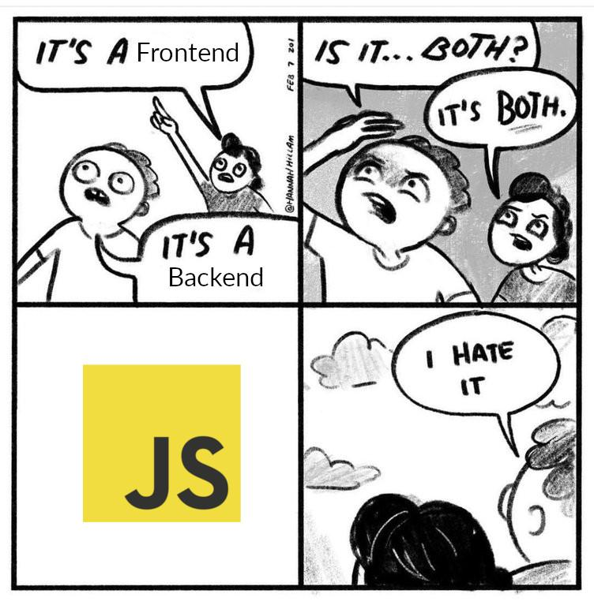
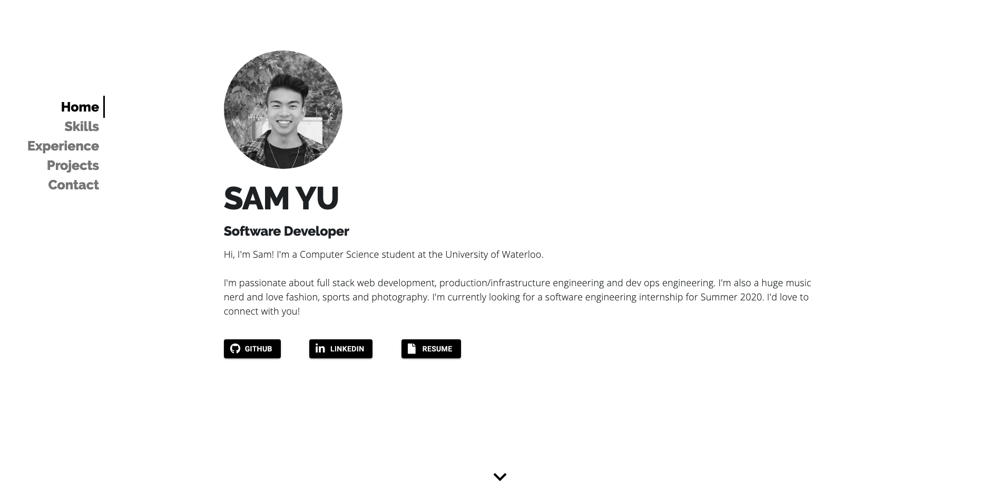

## Welcome to my new site/blog!
This is where I will share things I find interesting, mostly related to software development and music!
Those things will mostly be independent (_unless it's about software related to music)_ so feel free to use the coloured tags on sidebar of the
[blog page](/blog) to filter by categories.

### Software development topics
My background in software development primarily comes from my ongoing Bachelor's degree in Computer Science at the
University of Waterloo in Waterloo, Ontario, Canada in conjunction with my industry experience.

Here are a couple of companies I've worked for and their respective roles, as well as tech stacks:
- Software Engineer at Webveloper
  - _JavaScript ES6, React, Node, Express.js, Docker, Kubernetes, Google Cloud Platform_
- Full Stack Software Engineer at OnCall Health
  - _Python, Django, PostgreSQL, AWS_

Clearly my background is primarily in web development, and many software related posts will involve web technologies of some sort.
However, I may also post about other software topics I find interesting down the line.



### Music topics
As for music related topics, these will primarily be separated into music discussion and creating music.

#### Music discussion
This will consist primarily of music reviews and discussions, but all posts related to the consumption of music will be under this category.
The genres I mostly listen to are hip-hop, EDM, pop and rock, but I'd rather not constrain myself based on genre and thus are open to
listening/discussing any type of music.

The landing page loads my latest played song off Spotify using last.fm's API (_using an API key that doesn't require auth so you can't mess with my account_). I'll have a post about how I built it up soon — hopefully you don't come on the site when I'm listening to something embarrassing #:grimacing:

If you have any music recommendations feel free to shoot me a message at my [email](mailto: smyu03@gmail.com)!

#### Creating music
My musical background is mostly in playing instruments, I'm classically trained at piano (_Grade 10 RCM for my fellow canucks_) and I picked up a guitar in middle school and have been in love with it ever since. However, I am very rusty at piano and somehow remember how to play a few songs purely through muscle memory.

I've recently started learning to use Ableton Live with the primary goal of producing my own music. Currently I'm working on a melodic dubstep song heavily inspired by [Seven Lions](https://open.spotify.com/track/00EFWaqXnHZ5smJNsHtnGV?si=0npPhfhGQ8q2HY0flVEyyA). I'm constantly trying to improve my production and I would love to hear any tips/feedback you have!

---

## Building the site/blog


I decided to rebuild my site from the ground up due to a combination of growing tired with the old design and the desire to explore some new features/technologies. The site is primarily made using Gatsby.js, a static site generator/framework with it's own ecosystem of plugins. It also uses React and TypeScript and is hosted on Github Pages.

### Why Gatsby?
What you're seeing here is written completely in Markdown, and is parsed to html and generated using a plugin called [gatsby-transformer-remark](https://www.gatsbyjs.org/packages/gatsby-transformer-remark/) (which is a Gatsby plugin that also supports having it's own plugins #:open_mouth:).

Gatsby spins up it's own node server during build time in which you can automatically create these pages based on the Markdown files, which saves a lot of time compared to writing HTML for each posts. 

```javascript
posts.forEach((post, index) => {
    const previous = index === posts.length - 1 ? null : posts[index + 1].node;
    const next = index === 0 ? null : posts[index - 1].node;

    createPage({
      path: post.node.fields.slug,
      component: blogPost,
      context: {
        slug: post.node.fields.slug,
        previous,
        next,
      },
    });
  });
```

My next goal is to create a build trigger using Github Actions which runs the build every time I push a commit with new blog posts. In the future, I'd like to explore sourcing posts from a Google Drive folder and having the build step pull posts from Google Drive folder when a Github Action is triggered, completely removing the need to be at my computer to write posts!

I'll make a guide on how to do that once it's done! #:smile:

### Using TypeScript for the first time
This was my first time building a React site using TypeScript, and in my opinion came with both pros and cons.

**Pros:**
- Static typing meant less compile-time errors
- Much better code suggestions
- Easy to migrate from vanilla JS

**Cons:**
- Some npm packages/modules don't have very good type definitions
- Longer development time
- More lines-of-code _(Gatsby's complicated object structures don't help)_

```typescript
// Pros: No more "Property does not exist" errors when compiling!
// Cons: Having to write long types like this for each component :/
type PostsListProps = {
  posts: {
    node: {
      frontmatter: {
        title: string;
        date: string;
        description: string;
      };
      fields: {
        slug: string;
      };
    };
  }[];
  listTitle: string;
  className: string;
}
```

Overall, I'm not entirely sure the more complicated code was worth it for a small React based codebase, but I can definitely see the appeal for maintaining larger a codebase. However, I'm definitely going to try TypeScript with a Node backend for my next project and see if the static typing is more comfortable.

Although this is the only one post at time of writing, please check the site out! I'm planning to add About and Projects pages in the near future and hopefully stay active with these blog posts.
